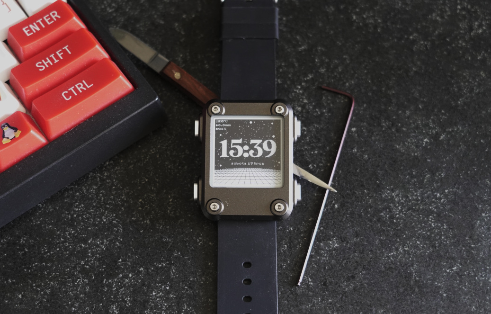
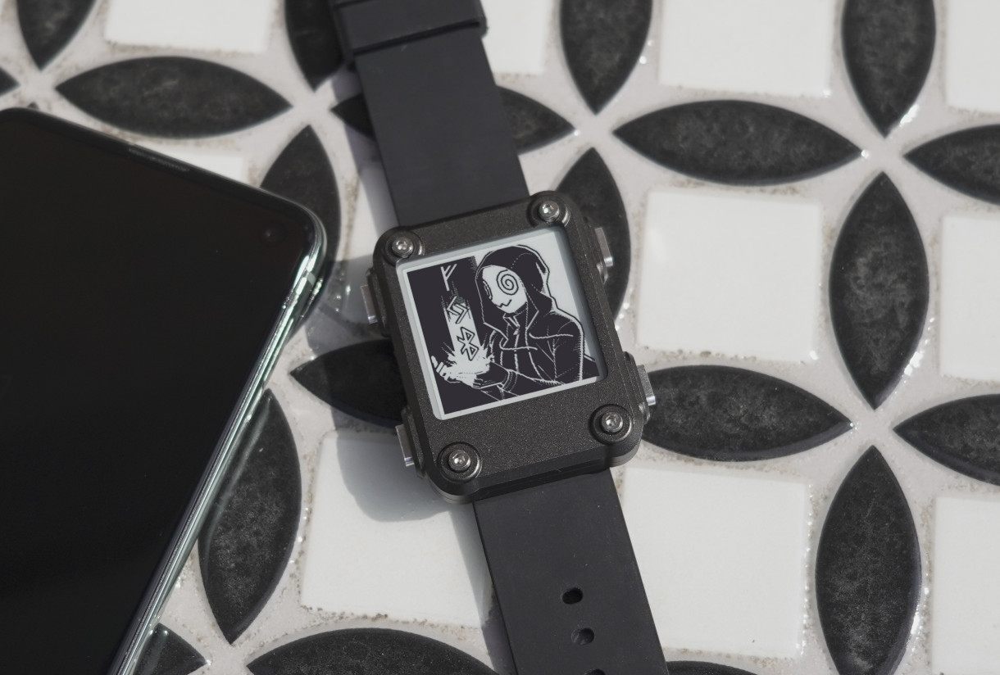

# CatchyWatchy

CatchyWatchy is a ROM for [Watchy by SQFMI](https://watchy.sqfmi.com/).

## Status

CatchyWatchy was developed for personal use and some settings were hardcoded during its development. The UI language is set to Polish, the weather location is set to Łódź, timezone, WiFi SSID & password are provided as C constants. You will have to edit CatchyWatchy sources & rebuild it in order to personalize it. The recommended way to do this is to use clone this repo & open it with VSCode with PlatformIO extension installed.

The Bluetooth Settings Screen should allow for customization of the watch settings but is not implemented at the moment. The plan for this screen is to expose a Bluetooth GATT Service which allows reading & writing of watch properties. Reading & writing of watch settings can be achieved using a Bluetooth Companion Web App based on https://web.dev/bluetooth/ & hosted on GitHub. Neither Bluetooth GATT Service nor the Bluetooth Companion Web App are implemented though. The Bluetooth Settings Screen is an image only. The personal use case of the author was satisfied with hardcoded values so the Bluetooth Settings Screen is only a loose plan at this point.

Working features:

* Current time & date
* Current battery charge percentage
* Current temperature & rainfall
* WiFi time & weather synchronization every 30 minutes
* Timer

The weather is fetched from [IMGW](https://www.imgw.pl/en) (Institute of Meteorology and Water Management in Poland) - if you live elsewhere you'll probably want to change it to a different weather provider.

Pull requests are welcome!

## Usage

Main Screen:

* Upper Left Button => Nothing
* Upper Right Button => Nothing
* Lower Left Button => Go to Bluetooth Settings Screen
* Lower Right Button => Go to Timer screen, start 1-minute countdown

Bluetooth Settings Screen:

* Upper Left Button => Nothing
* Upper Right Button => Nothing
* Lower Left Button => Go to Main Screen
* Lower Right Button => Nothing

Timer:

* Upper Left Button => Nothing
* Upper Right Button => Add 5 minutes to the countdown
* Lower Left Button => Go to Main Screen
* Lower Right Button => Add 1 minute to the countdown

## Art

The art used in this watch face is closely based on:

* Main Screen - StarryHorizon watch face on GitHub: https://github.com/dandelany/watchy-faces/
* Bluetooth Settings Screen - KadaburaDraws on Twitter: https://twitter.com/KadaburaDraws
* Timer - Hammerbeam Tea Corp. on Instagram: https://www.instagram.com/hammerbeam_tea_corp/
* Date Font - Pokemon Classic font by TheLouster115 on DaFont: https://www.dafont.com/pokemon-classic.font
* Time Font - MADE Sunflower font by MadeType on DaFont: https://www.dafont.com/made-sunflower.font
